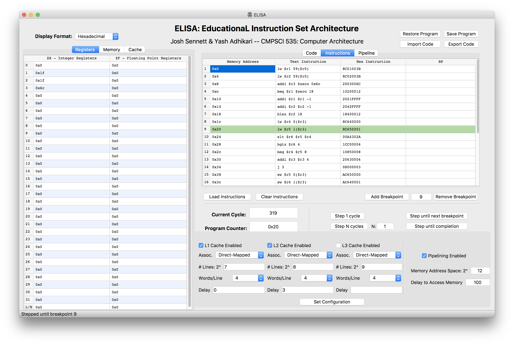

 

# ELISA: EducationaL Instruction Set Architecture 
ELISA is a general purpose instruction set architecture written in Python and based on MIPS. The goal of ELISA is to provide a custom instruction set simulator with a friendly user-interface that can be used to educate about the fundamentals of computer architecture and instruction set design.  See the full writeup [here](docs/ELISA.pdf).

### Features
1. User-friendly GUI to view step by step how an ELISA program is executed
2. A real assembler 
3. Customizable memory heirarchy! Simulate a program with up to three levels of caching, and customize cache size, associativity, and delay.
4. Benchmark tests written in ELISA assembly, including exchange sort and matrix multiplication.
5. GUI views of memory, assembled instructions, and pipeline internals
5. A full code editor, if you want to hack away in assembly
6. The ability to add breakpoints in your program, run N cycles, or run your program to completion

## Setup
`pip3 install -r requirements.txt`

## How to run

### Graphical User Interface
`cd src/`
`python3 gui/gui.py`

### Simulator Demo
`python3 src/simulator_demo.py`

### Memory Demo
`python3 src/memory_demo.py`

## How to build

### Rebuild the GUI
`pyuic5 src/gui/gui.ui -o src/gui/mainwindow.py`

## How to test
`pytest`
